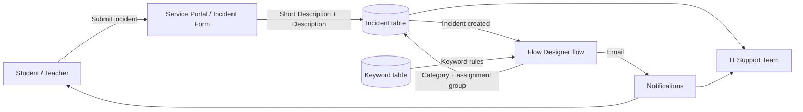
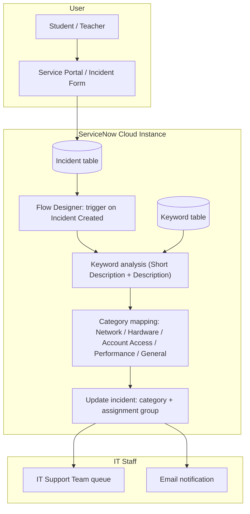

# Auto Ticket Classification using Flow

**Team ID:** SWTID-2026-5440
**Date:** 06 October 2026
**Platform:** ServiceNow (Flow Designer, Incident Management)

> Automatically classifying school IT helpdesk incidents by analyzing keywords in the *Short Description* and *Description* fields.

---

## Table of Contents

1. [Introduction](#1-introduction)
2. [Ideation Phase](#2-ideation-phase)
3. [Requirement Analysis](#3-requirement-analysis)
4. [Project Design](#4-project-design)
5. [Project Planning & Scheduling](#5-project-planning--scheduling)
6. [Functional and Performance Testing](#6-functional-and-performance-testing)
7. [Results](#7-results)
8. [Advantages & Disadvantages](#8-advantages--disadvantages)
9. [Conclusion](#9-conclusion)
10. [Future Scope](#10-future-scope)
11. [Appendix](#11-appendix)

---

## 1. Introduction

### 1.1 Project Overview

The school IT helpdesk receives many incident requests every day from students and teachers. Typical requests include Wi-Fi issues, projector failures, password problems and slow computers. At present, IT staff review each request by hand and assign a category, which is time-consuming and inefficient.

This project automates ticket classification using **ServiceNow Flow Designer**. When a new incident is created, a flow analyzes the keywords in the incident's *Short Description* and *Description* fields, sets the matching category, and routes the ticket to the right support group.

### 1.2 Purpose

- Remove the manual step of reading and categorizing every incident.
- Give consistent categories to tickets, whatever wording the user uses.
- Reduce the time between a ticket being raised and reaching the right IT staff.
- Let IT staff spend their time fixing problems instead of sorting tickets.

---

## 2. Ideation Phase

### 2.1 Problem Statement

> **How might we** automatically classify and categorize incoming IT helpdesk incidents (Wi-Fi, projector, password, slow computer) by analyzing the short description and description, so IT staff no longer have to review each ticket manually?

| Who has the problem | What the problem is | Why it matters |
|---|---|---|
| IT helpdesk staff | Every ticket must be read and categorized by hand | Slow, repetitive and inefficient |
| Students and teachers | Tickets can wait in an unsorted queue or get the wrong category | Delays in fixing issues that disrupt classes |

### 2.2 Empathy Map Canvas

**Persona:** School IT helpdesk staff member

| | |
|---|---|
| **Says** | "I have too many tickets to sort." / "This one should go to the network team." |
| **Thinks** | "Reading every ticket takes too long." / "Some categories are wrong." |
| **Does** | Reads each incident, picks a category, assigns it to a group, answers follow-ups about delays |
| **Feels** | Overloaded, pressured, frustrated by repetitive work |
| **Pain** | Manual triage, inconsistent categories, growing backlog |
| **Gain** | Tickets arrive already categorized and routed, so time goes to solving issues |

### 2.3 Brainstorming

Ideas were collected from the team, grouped into themes, and prioritized by importance and feasibility.

| Theme | Ideas |
|---|---|
| Trigger & keyword detection | Flow on incident creation; match keywords in Short Description; also scan Description; editable keyword table |
| Keyword-to-category mapping | Wi-Fi/internet → Network; projector/display → Hardware; password/login → Account Access; slow/hang → Performance; default → General |
| Routing & communication | Auto-assign to support group; set priority from keywords; notify the caller |
| Future enhancements | Dashboard per category; ML-based classification; chatbot / self-service portal |

**Prioritized first (high importance, high feasibility):** flow trigger on incident creation, keyword matching in both fields, category mapping, default "General" category, auto-assignment to support group.

---

## 3. Requirement Analysis

### 3.1 Customer Journey Map

| Stage | User action | Experience today | With this project |
|---|---|---|---|
| Problem occurs | Projector, Wi-Fi, account or computer fails | Frustrated, class is disrupted | Same |
| Report | Submits an incident with short description and description | Unsure when help will come | Receives incident number |
| Triage | IT staff reads and categorizes the ticket | Slow, manual | **Flow classifies it automatically** |
| Assignment | Ticket is assigned to a group | Manual, can be delayed | **Routed automatically by category** |
| Resolution | IT staff fixes the issue | Starts late | Starts sooner |
| Follow-up | Caller is informed | Often has to ask | Receives notification |

### 3.2 Solution Requirement

**Functional requirements**

| ID | Requirement |
|---|---|
| FR-1 | Users can submit an incident with a short description and a description |
| FR-2 | A flow starts automatically when a new incident is created |
| FR-3 | The flow reads keywords in both the short description and the description |
| FR-4 | The flow sets the category: Network, Hardware, Account Access, Performance, or General |
| FR-5 | The flow assigns the incident to the right support group |
| FR-6 | The caller and IT staff are notified |
| FR-7 | Admins can add or edit keywords without changing the flow |

**Non-functional requirements**

| Area | Requirement |
|---|---|
| Usability | Users only fill in the normal incident form; no extra steps |
| Security | Role-based access to the keyword table and flow |
| Reliability | Tickets with no keyword match fall back to "General" |
| Maintainability | Keywords stored in a table, not hard-coded |
| Performance | Classification runs automatically as soon as the incident is created |

### 3.3 Data Flow Diagram



### 3.4 Technology Stack

| Component | Technology |
|---|---|
| User interface | ServiceNow Service Portal / Incident form (HTML, CSS, JavaScript) |
| Application logic | ServiceNow Flow Designer (trigger: Incident Created), conditions / script step |
| Database | ServiceNow Now Platform database (Incident table, custom keyword table) |
| Cloud | ServiceNow cloud instance (Personal Developer Instance) |
| File storage | ServiceNow Attachments |
| Notifications | ServiceNow Email Notifications |
| Machine learning | Not used (rule-based keyword matching) |
| Security | ServiceNow roles and ACLs, HTTPS (TLS) |

---

## 4. Project Design

### 4.1 Problem Solution Fit

| Block | Summary |
|---|---|
| Customer segment | Students, teachers and school IT helpdesk staff |
| Constraints | Small IT team, free-text tickets, limited budget, must work in ServiceNow |
| Available solutions | Manual review and categorization by IT staff (slow, inconsistent) |
| Jobs-to-be-done | Resolve Wi-Fi, projector, password and slow-computer issues quickly |
| Root cause | Every incident is categorized by hand with no automatic rule |
| Behaviour | Users submit tickets or call the IT desk; staff read and assign each one |
| Triggers | Projector or Wi-Fi fails in class; locked account before a lesson; slow computer |
| Emotions | Before: frustrated and stressed. After: relieved and confident |
| Solution | Flow Designer flow that classifies and routes tickets automatically |
| Channels | Online: Service Portal and email. Offline: IT desk and phone calls (logged in ServiceNow) |

### 4.2 Proposed Solution

A Flow Designer flow is triggered whenever an incident is created. It checks the **Short Description** and **Description** against a table of keywords and sets the category.

| Keywords (examples) | Category |
|---|---|
| wifi, wi-fi, internet, network | Network |
| projector, display, screen | Hardware |
| password, login, locked, reset | Account Access |
| slow, hang, freeze, lag | Performance |
| *(no match)* | General |

After the category is set, the flow assigns the incident to the matching support group and notifies the caller and IT staff. Because the keywords live in a table, admins can change them without editing the flow.

### 4.3 Solution Architecture



---

## 5. Project Planning & Scheduling

### 5.1 Project Planning

Four sprints of 6 days each, 20 story points per sprint (80 in total).

| Sprint | Focus | Story points | Start | End (planned) |
|---|---|---|---|---|
| Sprint-1 | Setup, categories, keyword table, incident submission, flow trigger | 20 | 12 Oct 2026 | 17 Oct 2026 |
| Sprint-2 | Keyword reading and category mapping (Network, Hardware, Account Access, Performance) | 20 | 19 Oct 2026 | 24 Oct 2026 |
| Sprint-3 | General fallback, category update, routing, priority, notifications, staff view | 20 | 26 Oct 2026 | 31 Oct 2026 |
| Sprint-4 | Testing, keyword refinement, dashboard, documentation, final release | 20 | 02 Nov 2026 | 07 Nov 2026 |

**Velocity:** AV = velocity / sprint duration = 20 / 6 ≈ **3.33 story points per day**.

---

## 6. Functional and Performance Testing

### 6.1 Performance Testing

User acceptance testing covered each part of the flow. *(Update the numbers below with your own results.)*

| Section | Total cases | Not tested | Fail | Pass |
|---|---|---|---|---|
| Incident Submission | 6 | 0 | 0 | 6 |
| Flow Trigger | 4 | 0 | 0 | 4 |
| Keyword Classification – Short Description | 12 | 0 | 1 | 11 |
| Keyword Classification – Description | 10 | 0 | 0 | 10 |
| Default Category (General) | 3 | 0 | 0 | 3 |
| Assignment Group Routing | 5 | 0 | 0 | 5 |
| Email Notifications | 4 | 0 | 0 | 4 |
| Security (Roles & Access) | 3 | 0 | 0 | 3 |
| Reporting / Dashboard | 3 | 1 | 0 | 2 |
| **Total** | **50** | **1** | **1** | **48** |

Sample test tickets used for each category:

| Short description | Expected category |
|---|---|
| "Wi-Fi not working in lab 2" | Network |
| "Projector not turning on" | Hardware |
| "Forgot my password" | Account Access |
| "Computer is very slow" | Performance |
| "Need help with a form" | General |

---

## 7. Results

### 7.1 Output Screenshots

> Add your screenshots to a `screenshots/` folder and update the links below.

| Screenshot | Description |
|---|---|
| `` | Incident submission form |
| `` | Flow Designer flow |
| `` | Keyword-to-category table |
| `` | Incident after automatic classification |
| `` | Email notification |

---

## 8. Advantages & Disadvantages

**Advantages**

- Removes manual reading and categorizing of each ticket.
- Gives consistent categories and faster routing.
- Keywords can be changed in a table with no flow changes.
- Built on the school's existing ServiceNow platform, with no extra servers.
- Easy to extend with new categories.

**Disadvantages**

- Rule-based, so tickets without the expected keywords go to "General".
- Misspellings or unusual wording may not match.
- A ticket mentioning several issues gets only one category.
- Keyword lists need regular review.

---

## 9. Conclusion

The project replaces manual ticket sorting with an automatic ServiceNow Flow Designer flow that reads the short description and description of each new incident, assigns a category, and routes it to the right group. This saves IT staff time, makes categories consistent, and helps students and teachers get their issues handled sooner.

---

## 10. Future Scope

- Use ServiceNow Predictive Intelligence (machine learning) for tickets that keywords cannot classify.
- Handle misspellings and multiple issues in one ticket.
- Add a dashboard showing tickets per category and resolution time.
- Add a chatbot or self-service portal for raising tickets.
- Integrate chat tools such as Teams or Slack through the ServiceNow REST API.

---

## 11. Appendix

### Source Code (if any)

The solution is configured in ServiceNow rather than written as an application. Core logic:

```text
Flow: Auto Ticket Classification
Trigger : Incident -> Created

1. Get keyword rules from the Keyword table
2. If Short Description OR Description contains a Network keyword        -> Category = Network
3. Else if ... contains a Hardware keyword                               -> Category = Hardware
4. Else if ... contains an Account Access keyword                        -> Category = Account Access
5. Else if ... contains a Performance keyword                            -> Category = Performance
6. Else                                                                  -> Category = General
7. Update Record: set Category and Assignment group
8. Send notification to caller and IT staff
```

### Dataset Link

Not applicable. The solution uses incident records and a keyword table inside ServiceNow, not an external dataset.

### GitHub & Project Demo Link

- **GitHub repository:** `<add your repository link here>`
- **Project demo video:** `<add your demo link here>`
